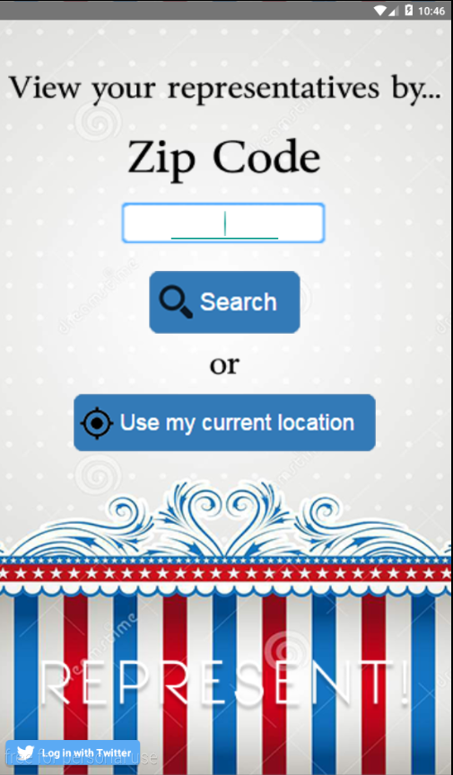
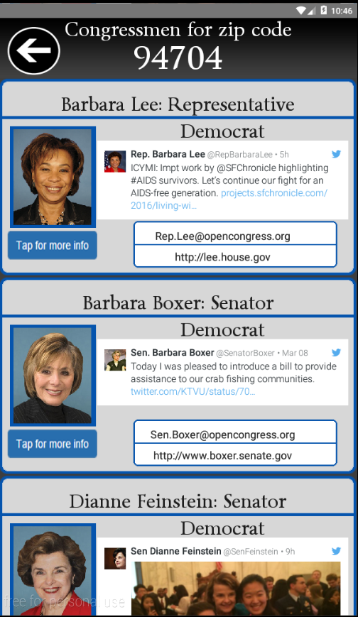
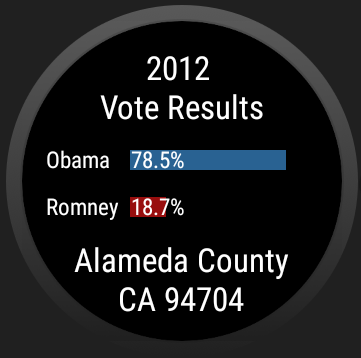

# PROG 02: Represent!

The Represent! App is designed to allow users make more informed decisions for voting. Users are greeted with the main view upon opening the app, where they can either have the app detect their current location, or input one on their own.

After the user presses "Search", they are taken to the congressional view where they can view the representatives for the zip code they entered. Included are their names, emails, websites, twitter, and other information. If the user wants to see more about a representative, they can also tap the button under the picture.

Tapping that button will give the user a more detailed view of the selected individual, showing information such as bills, committees, and end of term.

A watch app is also included. The watch app will automatically start once the user inputs a zip code from the main view, when the congressional view is brought up. The watch will display one screen for each of the representatives on the phone app. The user can swipe through the representatives on the watch.

The user can also tap on an individual on the watch. Doing so will bring the user to the detailed view on the mobile app, as well as display the voting view on the watch, which displays the voting spread for the 2012 elections.

Finally, the user can also shake their watch to get a random location. Doing so will take the user back to the main view on the phone, where a random zip code will be inputted for them.
## Authors

Michael Wu ([wu.michael.m@berkeley.edu](mailto:wu.michael.m@berkeley.edu))

## Links

See [the demo video: https://youtu.be/8mrLe1l-7Fk] (https://youtu.be/8mrLe1l-7Fk)
The [github repository](https://github.com/cs160-sp16/prog-02-represent-Rigaudon)

## Screenshots

Mobile Views

Watch Views

## Acknowledgments

* Thanks to the CS160 staff for providing skeleton code!
* Accellerometer code was adapted from http://code.tutsplus.com/tutorials/using-the-accelerometer-on-android--mobile-22125