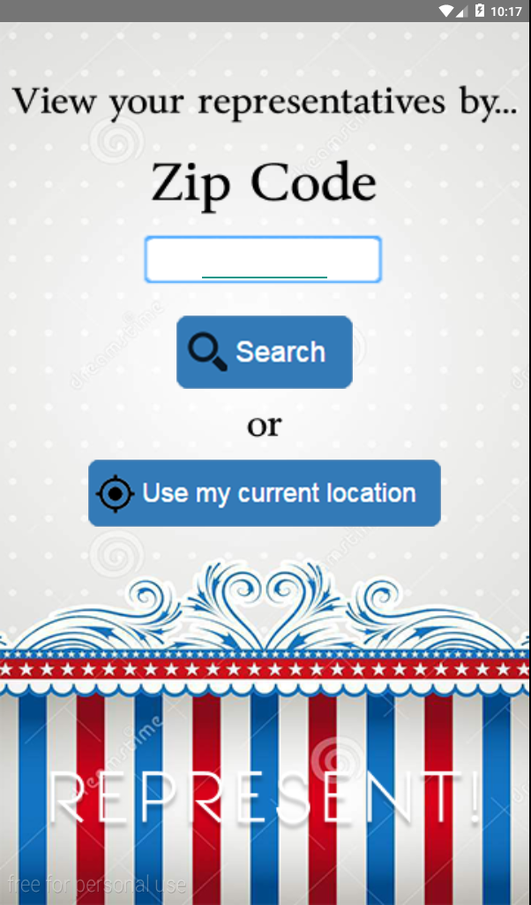
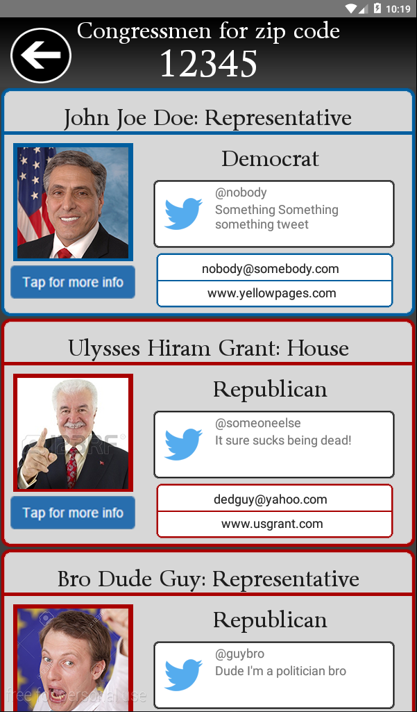
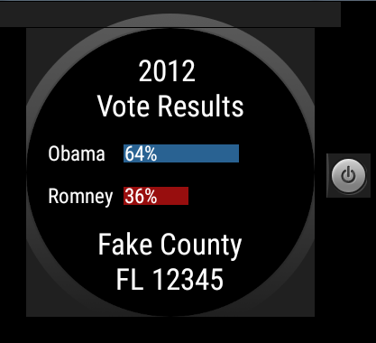

# PROG 02: Represent!

This is a functional version of the Represent! app. This version does not have the APIs implemented yet, so it is not usable, but all the functionality is implemented. This app allows users to input a zip code and see the representatives for that zip code as well as information regarding each candidate. The app also supports Android wear, which can interact with the phone app and also display information such as the voting results from the past election.

## Authors

Michael Wu ([wu.michael.m@berkeley.edu](mailto:wu.michael.m@berkeley.edu))

## Demo Video

See [the demo video: https://youtu.be/crl9s5q0dRI] (https://youtu.be/crl9s5q0dRI)

## Screenshots

Mobile Views

Watch Views

## Acknowledgments

* Thanks to the CS160 staff for providing skeleton code!
* Accellerometer code was adapted from http://code.tutsplus.com/tutorials/using-the-accelerometer-on-android--mobile-22125